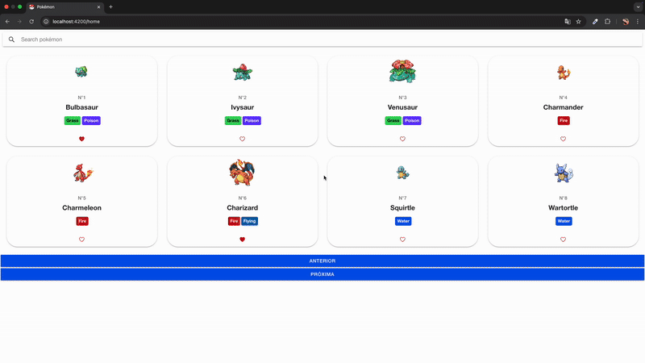

# Desafio de Listagem de Pokémons (BNS)

Este projeto é um aplicativo de lista e detalhes de Pokémon construído com Ionic e Angular usando a API pública do PokéAPI.

https://desafio-pokemon-sigma.vercel.app/home

## Demonstração da Usabilidade



### ToDo List

- Teste unitários;
- Uma v2 da UI.

## Pré-requisitos

- Node.js (v18.x ou superior recomendado)
- Angular CLI (v19)
- Ionic v8
- npm (v9.x ou superior) ou yarn

## Configuração e Execução

1.  **Clonar o repositório:**

    ```bash
    git clone <https://github.com/hebertdelima13/desafio-pokemon.git>
    cd desafio-pokemon
    ```

2.  **Instalar dependências:**

    ```bash
    npm install
    ```

3.  **Servidor de Desenvolvimento:**
    Para iniciar o servidor de desenvolvimento local:

    ```bash
    ng serve
    # ou
    npm start
    ```

    Abra seu navegador e navegue para `http://localhost:4200/`. A aplicação recarregará automaticamente ao modificar os arquivos de origem.